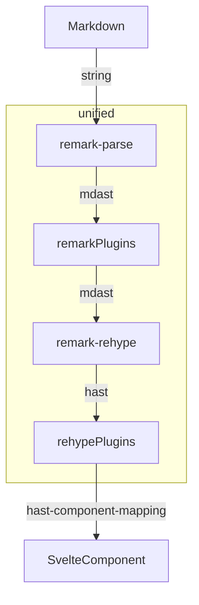

# Plugin system

This library uses [unified](https://github.com/unifiedjs/unified).
Therefore, you can use [remark](https://github.com/remarkjs/remark) or [rehype](https://github.com/rehypejs/rehype) plugins.

## Rendering flow



## API

```ts
export type ComponentsMap = Record<string, typeof SvelteComponent>;
export type Plugin = {
	remarkPlugin?: Pluggable;
	rehypePlugin?: Pluggable;
	renderer?: ComponentsMap;
};
```

## GFM(GitHub Flavored Markdown) Plugin

`gfmPlugin` is the only plugin that comes with the library.

It includes [remark-gfm](https://github.com/remarkjs/remark-gfm) and some component map(e.g. `table`, `tbody`, etc..).

_definition_

```ts
export const gfmPlugin: Plugin = {
	remarkPlugin: remarkGfm,
	renderer: {
		del: Del,
		table: Table,
		tbody: Tbody,
		thead: Thead,
		tr: Tr,
		th: Th,
		td: Td
	}
};
```
