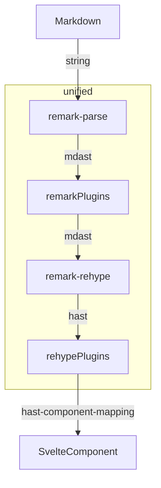

# Plugin overview

This library uses [unified](https://github.com/unifiedjs/unified).
Therefore, you can use [remark](https://github.com/remarkjs/remark) or [rehype](https://github.com/rehypejs/rehype) plugins.

And you can custom hast(Hypertext AST) to svelte component mapping.

## Rendering flow



## Plugin API

You can make a plugin with the following API.

```ts
import type { ComponentType, SvelteComponent } from 'svelte';
import type { Pluggable } from 'unified';
export type ComponentsMap = Record<string, ComponentType<SvelteComponent>>;
export type Plugin = {
	remarkPlugin?: Pluggable;
	rehypePlugin?: Pluggable;
	renderer?: ComponentsMap;
};
```

And you can set multiple plugins into `plugins` props.

```svelte
<script lang="ts">
	import Markdown from 'svelte-exmarkdown';
	import type { Plugin } from 'svelte-exmarkdown';
	const plugins: Plugin[] = [];
</script>

<Markdown md="# Hello world" {plugins} />
```

### Example

The GFM plugin is in the library. It is implemented as follows.

```ts
import remarkGfm from 'remark-gfm';
import type { Plugin } from '../types';
export const gfmPlugin = (options = {}): Plugin => ({
	remarkPlugin: [remarkGfm, options]
});
```
